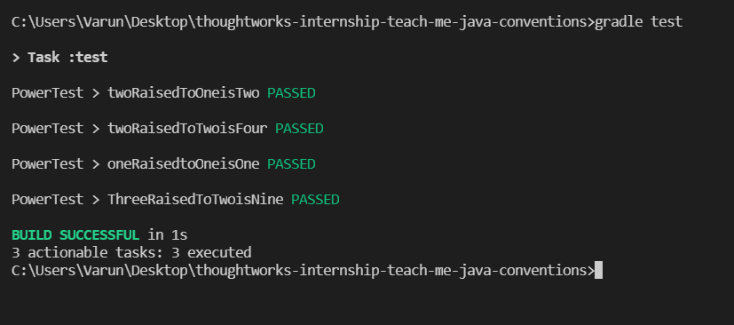

-   Alright. Akshay has recently started to learn Java and its associated unit testing library JUnit.
-   to practice he wrote some code to find the `x^y` without using any library functions (like `Math.pow`) and he also wrote some of its associated unit test.
-   but he was also in a rush and didn't care about clean code or basic java conventions. Now he is not sure why Intellij (or gradle for that matter) won't run his test. Also his code looks ugly. Can you help him fix these problems.
    -   
-   ensure you fix the issue due to which tests are not running, secondly take care of basic java naming conventions, third look for anything inconsistent or typo and anything else you think can be improved.

## Solution

